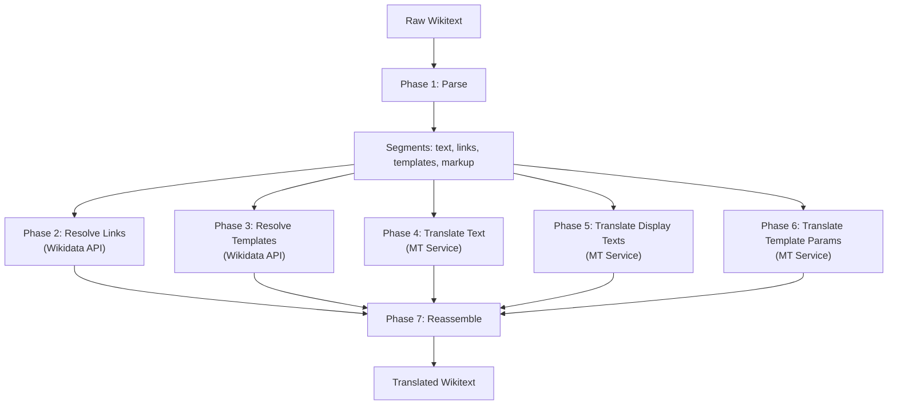

# Translation Pipeline

This document explains how the translation pipeline works end-to-end, from receiving raw wikitext to producing a fully translated version.

## The Problem

Translating Wikipedia articles is not simply running text through a translation API. Wikipedia wikitext contains:

- **Wikilinks** (`[[India]]`) that must resolve to the equivalent article in the target language
- **Templates** (`{{Infobox country|...}}`) whose names vary by language
- **Markup** (`== Heading ==`, `'''bold'''`) that must be preserved exactly
- **References** (`<ref>`) that should not be translated
- **Categories and files** that follow different conventions per language

If you simply translate the raw wikitext, the translation API will:

1. Mangle wiki markup syntax
2. Translate link targets as literal text (not resolve them)
3. Break template names
4. Remove or corrupt reference tags

## The Solution: Parse → Translate → Reassemble



## Pipeline Steps

### Step 1: Parse Wikitext

The [wikitext parser](../reference/wikitext-parser.md) breaks wikitext into typed segments using a stack-based algorithm:

```
Input:  "'''India''' is in [[South Asia]]. {{cite web|url=...}}"
Output: [
  { type: "text", content: "'''India''' is in " },
  { type: "link", target: "South Asia", display: null },
  { type: "text", content: ". " },
  { type: "template", content: "{{cite web|url=...}}" },
]
```

Protected elements (refs, comments, HTML tags) are extracted first and replaced with placeholders, so the stack parser doesn't get confused by `{` characters inside `<ref>` tags.

### Step 2: Resolve Wikilinks via Wikidata

Link targets like `South Asia` are sent to the Wikidata API in batches of 50:

```
GET https://www.wikidata.org/w/api.php?
  action=wbgetentities&
  sites=enwiki&
  titles=South Asia&
  props=sitelinks
```

Wikidata returns the equivalent title in every Wikipedia language. For `South Asia` → Hindi, the result is `दक्षिण एशिया`.

Results are cached in an LRU cache (500 entries, 30-minute TTL) to avoid redundant API calls when translating multiple paragraphs of the same article.

### Step 3: Resolve Template Names via Wikidata

Template names like `Infobox country` are looked up with a `Template:` prefix:

```
Title: "Template:Infobox country"
→ Wikidata lookup
→ hiwiki: "साँचा:देश जानकारी"
→ Stripped: "देश जानकारी"
```

### Step 4: Translate Text Segments

Plain text segments are sent to the configured translation service (MinT, Google, OpenAI, etc.). Long texts are automatically chunked:

- Texts over 4,500 characters are split on paragraph boundaries
- Each chunk is translated with retry logic (2 attempts, exponential backoff)
- Chunks are joined back together

### Step 5: Translate Display Texts

Wikilinks can have display text: `[[India|the Republic of India]]`. The display text `the Republic of India` is translated via the MT service separately from the link target.

If a link has no explicit display text (`[[South Asia]]`), the link target itself is used as the display text and translated.

### Step 6: Translate Template Parameters

Text-heavy template parameters (more than 20 characters, containing spaces, not numeric) are translated:

```
|description=A large country in South Asia
→ translated to:
|description=दक्षिण एशिया में एक बड़ा देश
```

Numeric values, dates, URLs, and short parameter values are preserved as-is.

### Step 7: Reassemble

All translated pieces are reassembled into valid wikitext:

- Text segments → replaced with translations
- Links → `[[translated_target|translated_display]]`
- Templates → `{{translated_name|translated_params}}`
- Everything else → preserved exactly as-is

## Error Handling

Each step has independent error handling:

| Step | On Failure |
|------|-----------|
| Wikidata link lookup | Original link target preserved |
| Wikidata template lookup | Original template name preserved |
| Text translation | Original text preserved |
| Display text translation | Original display text preserved |
| Template param translation | Original parameter value preserved |

The pipeline never loses data. If any external API fails, the original content is used as a fallback.

## Statistics

The pipeline returns detailed statistics:

```json
{
  "totalSegments": 45,
  "textSegments": 20,
  "linksFound": 12,
  "linksTranslated": 10,
  "templatesFound": 8,
  "templatesTranslated": 5,
  "templateParamsTranslated": 3,
  "errors": [],
  "timingMs": {
    "parsing": 5,
    "wikilinks": 800,
    "templates": 350,
    "textTranslation": 3200,
    "displayTexts": 1100,
    "templateParams": 900,
    "total": 6355
  }
}
```

This helps identify bottlenecks (usually text translation is the slowest step) and gives the user visibility into what was translated.
