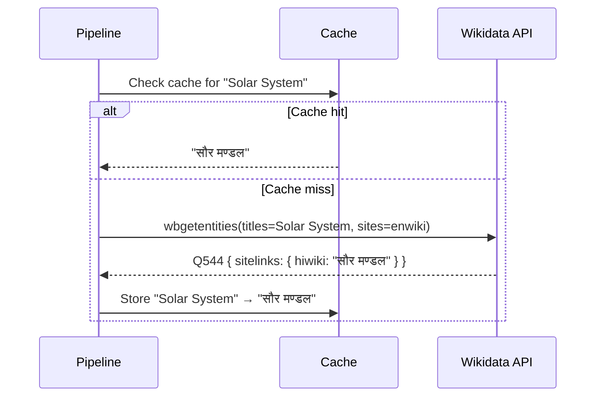

# Wikidata Link Resolution

This document explains how the Source Translation Tool resolves wikilinks across languages using the Wikidata API.

## The Problem

When you have a Wikipedia article in English with a link like `[[Solar System]]`, translating it to Hindi requires more than just translating the text "Solar System" — you need to find the exact title of the Hindi Wikipedia article about the solar system, which is `सौर मण्डल`.

Translating link targets as regular text would produce incorrect or non-existent article titles. The link would be broken.

## The Solution: Wikidata Sitelinks

[Wikidata](https://www.wikidata.org/) is the central knowledge base of the Wikimedia ecosystem. Every Wikipedia article is linked to a Wikidata item, and each item has **sitelinks** — mappings to article titles across all Wikipedia language editions.

For example, the Wikidata item [Q544](https://www.wikidata.org/wiki/Q544) (Solar System) has sitelinks:

- `enwiki` → "Solar System"
- `hiwiki` → "सौर मण्डल"
- `bnwiki` → "সৌরজগৎ"
- `tawiki` → "சூரியக் குடும்பம்"

## API Usage

The tool uses the Wikidata `wbgetentities` API with batch queries:

```
GET https://www.wikidata.org/w/api.php?
  action=wbgetentities&
  sites=enwiki&
  titles=Solar System|India|Mumbai&
  props=sitelinks&
  format=json&
  origin=*
```

This single request resolves up to 50 titles at once, returning sitelinks for each entity.

## How It Works



### Batch Processing

Links are processed in batches of 50 (the Wikidata API limit):

1. Extract all unique link targets from parsed segments
2. Check the LRU cache — skip already-resolved titles
3. Batch the remaining titles into groups of 50
4. Query Wikidata for each batch
5. Cache all results (30-minute TTL)

### Title Normalization

The Wikidata API normalizes titles (e.g., `solar system` → `Solar System`). The service handles this by checking the `normalized` field in the API response and mapping back to the original request titles.

### Template Name Resolution

Template names follow the same process but with a `Template:` prefix:

1. Template name `Infobox country` → lookup `Template:Infobox country`
2. Wikidata returns `साँचा:देश जानकारी` (Hindi)
3. The `Template:` prefix (or its localized equivalent like `साँचा:`) is stripped

## Caching

An LRU (Least Recently Used) cache reduces API calls:

| Property | Value |
|----------|-------|
| Max entries | 500 |
| TTL | 30 minutes |
| Key format | `fromLang:toLang:title` |

The cache is per-process (in-memory). It resets when the server restarts.

For a typical Wikipedia article with 20 links, the first paragraph batch populates the cache, and subsequent paragraphs get cache hits for overlapping links (like the article's own title, major subject links, etc.).

## Fallback Behavior

If Wikidata lookup fails for a title:

1. **No Wikidata item**: The article doesn't exist on Wikidata → original title preserved
2. **No target sitelink**: The article exists on Wikidata but has no article in the target language → original title preserved (the reader can still click the red link)
3. **API error**: Network/timeout → original title preserved, error logged to stats

The translation is never blocked by Wikidata failures. The fallback ensures the wikitext remains valid even if some links aren't resolved.

## Limitations

- **Disambiguation pages**: If a title points to a disambiguation page, the sitelink may be to the equivalent disambiguation page in the target language, not a specific article
- **Redirects**: The API resolves redirects, but the original title in the wikitext may differ from the canonical title
- **Non-article namespaces**: Category and file links use a different resolution mechanism (currently preserved as-is)
