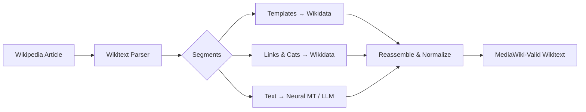

# Source Translation Tool

A powerful, open-source tool for translating Wikipedia articles between languages while preserving MediaWiki formatting, wikilinks, and templates.

## :material-star: Key Features

- **Context-Aware Translation** — Translates text using pluggable neural MT backends with preserved discourse context
- **Wikilink & Category Resolution** — Automatically resolves `[[wikilinks]]` and `[[Category:...]]` to target language editions via Wikidata
- **Dedicated Template Mode** — Translates complex multi-line templates (`Infobox person`, `Cite web`, `Taxobox`) with parameter value adaptation
- **Wiki Markup Preservation & Normalization** — Headings, lists, bold/italic formatting, refs, and embedded comments are preserved and auto-normalized
- **Universal Translation Backends** — MinT (Wikimedia), DeepL, Universal AI/LLM (Groq, DeepSeek, Ollama, OpenRouter), OpenAI GPT, Google Cloud, Microsoft Azure, LibreTranslate, and Custom REST MT
- **Wikipedia Direct Publishing** — Publish directly to Mainspace, User Sandbox, or Draft namespace with collision detection
- **Retina-Grade Natural Dark Mode** — Clean neutral zinc aesthetic with frosted glassmorphism for fatigue-free editing
- **Extensible Architecture** — Add new translation services with a single modular adapter function

## Quick Start

```bash
# Clone and install
git clone https://github.com/gyan111/source-translation.git
cd source-translation
npm install

# Start both frontend and backend
npm run dev:all
```

Then open [http://localhost:5173](http://localhost:5173) in your browser.

## How It Works



1. **Fetch** a Wikipedia article by title
2. **Parse** wikitext into typed segments using a stack-based parser
3. **Resolve** wikilinks, categories, and template names via the Wikidata sitelinks API
4. **Translate** plain text segments and template parameters using your chosen backend
5. **Reassemble & Normalize** everything back into clean, MediaWiki-compliant wikitext
6. **Preview & Publish** to Wikipedia namespaces (Mainspace, User Sandbox, Draft)

## Documentation Structure

This documentation follows the [Diátaxis framework](https://diataxis.fr/):

| Section | Purpose |
|---------|---------|
| [**Tutorials**](tutorials/getting-started.md) | Step-by-step learning guides |
| [**How-to Guides**](how-to/translate-template.md) | Task-oriented recipes |
| [**Reference**](reference/architecture.md) | Technical specifications |
| [**Explanation**](explanation/translation-pipeline.md) | Understanding how things work |

## Supported Languages

Supports 30+ languages including all scheduled Indian languages (Hindi, Odia, Bengali, Punjabi, Tamil, Telugu, Malayalam, Kannada, Marathi, Gujarati, etc.) plus major world languages (Arabic, Chinese, French, German, Japanese, Portuguese, Russian, Spanish, and more).

