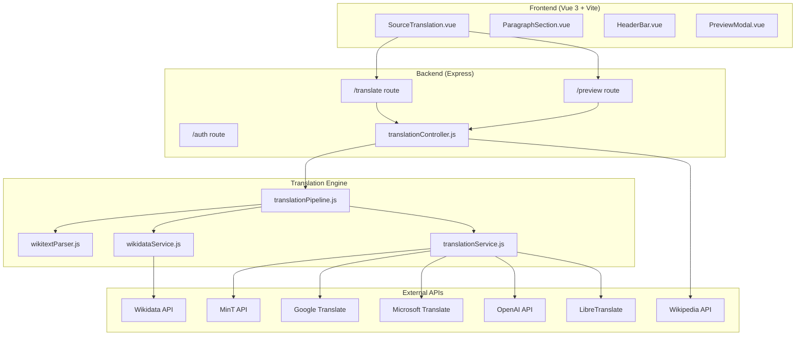

# Architecture

The Source Translation Tool is a full-stack application with a Vue.js frontend and Express backend, designed for translating Wikipedia articles while preserving MediaWiki formatting.

## System Architecture



## Directory Structure

```
source-translation/
├── src/                          # Frontend (Vue 3)
│   ├── components/
│   │   ├── SourceTranslation.vue # Main translation interface
│   │   ├── ParagraphSection.vue  # Source/translation paragraph pair
│   │   ├── HeaderBar.vue         # App header with dark mode, i18n
│   │   ├── PreviewModal.vue      # Wikipedia preview modal
│   │   ├── ProgressBar.vue       # Translation progress indicator
│   │   └── ...
│   ├── controllers/
│   │   └── translationController.js  # Express route handlers
│   ├── utils/
│   │   └── translationUtils.js   # Client-side helpers (legacy)
│   ├── i18n.js                   # UI internationalization
│   ├── App.vue                   # Root component
│   └── main.js                   # Vue app entry
├── server/                       # Backend (Express)
│   ├── server.js                 # Express app setup
│   ├── routes/
│   │   ├── translate.js          # POST /translate
│   │   ├── preview.js            # POST /preview
│   │   └── auth.js               # OAuth routes
│   └── services/
│       ├── translationPipeline.js  # Orchestrates full translation
│       ├── translationService.js   # Pluggable MT adapters
│       ├── wikitextParser.js       # Stack-based wikitext parser
│       └── wikidataService.js      # Wikidata sitelink resolver
├── doc/                          # MkDocs documentation
│   ├── mkdocs.yml
│   └── docs/
├── package.json
├── vite.config.js
└── tailwind.config.js
```

## Tech Stack

| Layer | Technology |
|-------|-----------|
| Frontend | Vue 3 (Options API) |
| Styling | TailwindCSS 3 |
| Build | Vite 5 |
| Backend | Express 4 |
| HTTP Client | Axios |
| i18n | vue-i18n |
| Dev Server Proxy | Vite proxy |

## Data Flow

### Translation Request

1. User clicks "Translate" on a paragraph
2. Frontend POSTs to `/translate` with `{ text, fromLanguage, toLanguage, translationService }`
3. Controller calls `translateWikitext()` from the pipeline
4. Pipeline parses wikitext → resolves links via Wikidata → translates text → reassembles
5. Response: `{ translatedText, stats }` returned to frontend
6. Frontend updates the paragraph's translation field

### Article Fetch

1. User enters article name
2. Frontend directly calls Wikipedia's `action=parse` API (CORS-enabled with `origin=*`)
3. Raw wikitext is split into paragraphs on `\n\n` boundaries
4. Each paragraph becomes a `ParagraphSection` component

## Key Design Principles

- **Pluggable backends**: New translation services can be added by writing a single adapter function
- **Wikidata-first link resolution**: Wikilinks are resolved via Wikidata sitelinks, which is the authoritative source for cross-language article mapping
- **Graceful degradation**: If any step fails, the original text is preserved
- **LRU caching**: Wikidata lookups are cached to avoid redundant API calls
