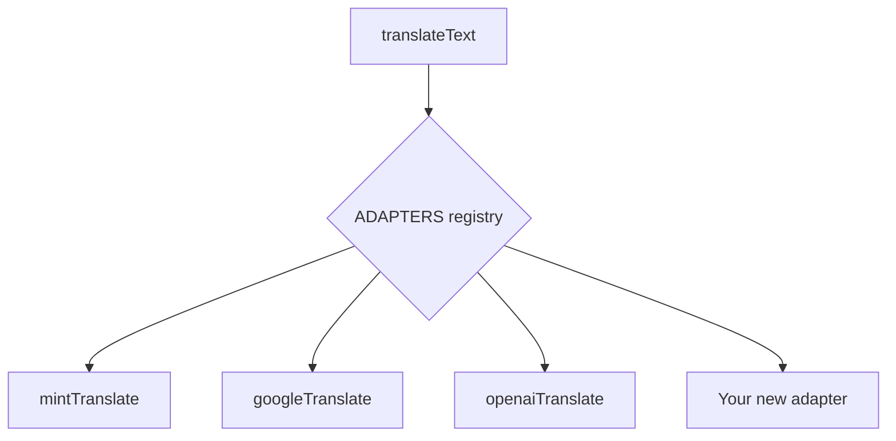

# Adding a Translation Service

This tutorial shows you how to add a new translation backend to the Source Translation Tool. The system uses an adapter pattern that makes it straightforward to plug in any translation API.

## Architecture Overview

Translation services are defined in `server/services/translationService.js`. Each service is an async function (adapter) that takes text and returns translated text. The adapter registry maps service IDs to their functions.



## Step 1: Write the Adapter Function

Create your adapter function in `server/services/translationService.js`. It must follow this signature:

```javascript
/**
 * @param {string} text - Text to translate
 * @param {string} fromLang - Source language code (e.g., 'en')
 * @param {string} toLang - Target language code (e.g., 'hi')
 * @param {Object} options - { apiKey, apiEndpoint, model }
 * @returns {string} Translated text
 */
async function myServiceTranslate(text, fromLang, toLang, options) {
  // Your implementation here
  const response = await axios.post('https://api.myservice.com/translate', {
    text,
    source: fromLang,
    target: toLang,
  }, {
    headers: {
      'Authorization': `Bearer ${options.apiKey}`,
    },
    timeout: 30000,
  });

  const translated = response.data?.translated_text;
  if (!translated) throw new Error('Empty response from MyService');
  return translated;
}
```

!!! warning "Important Requirements"
    - **Always return a string** — never return `null` or `undefined`
    - **Throw on failure** — let the retry logic handle transient errors
    - **Respect timeout** — set a reasonable timeout (default: 30s)
    - **Handle empty input** — the framework handles this, but be defensive

## Step 2: Register the Adapter

Add your adapter to the `ADAPTERS` registry at the bottom of `translationService.js`:

```javascript
const ADAPTERS = {
  mint: mintTranslate,
  google: googleTranslate,
  microsoft: microsoftTranslate,
  openai: openaiTranslate,
  libretranslate: libreTranslate,
  myservice: myServiceTranslate,  // ← Add this line
};
```

## Step 3: Add Service Metadata

Update the `getAvailableServices()` function:

```javascript
export function getAvailableServices() {
  return [
    // ... existing services
    {
      id: 'myservice',
      name: 'My Translation Service',
      requiresKey: true,
      description: 'Description of your service',
    },
  ];
}
```

## Step 4: Add UI Option

In `src/components/SourceTranslation.vue`, add an option to the translation service dropdown:

```html
<select v-model="translationService" class="select-field py-2 text-xs w-auto">
  <!-- existing options -->
  <option value="myservice">My Service</option>
</select>
```

If your service requires an API key or custom endpoint, the UI already handles that — just update the computed properties:

```javascript
showApiKeyInput() {
  return ['google', 'microsoft', 'openai', 'libretranslate', 'myservice']
    .includes(this.translationService);
},
```

## Step 5: Test

```bash
# Start the servers
npm run dev:all

# Test directly via API
curl -X POST http://localhost:3000/translate \
  -H "Content-Type: application/json" \
  -d '{
    "text": "Hello world",
    "fromLanguage": "en",
    "toLanguage": "hi",
    "translationService": "myservice",
    "apiKey": "your-api-key"
  }'
```

Expected response:

```json
{
  "translatedText": "नमस्ते दुनिया",
  "stats": {
    "totalSegments": 1,
    "textSegments": 1,
    "linksFound": 0,
    "linksTranslated": 0,
    "templatesFound": 0,
    "templatesTranslated": 0
  }
}
```

## Example: Adding DeepL

Here's a complete example for adding DeepL as a translation service:

```javascript
async function deeplTranslate(text, fromLang, toLang, options) {
  const apiKey = options.apiKey;
  if (!apiKey) throw new Error('DeepL API key is required');
  
  const endpoint = options.apiEndpoint || 'https://api-free.deepl.com/v2/translate';
  
  // DeepL uses uppercase language codes
  const sourceLang = fromLang.toUpperCase();
  const targetLang = toLang.toUpperCase();
  
  const response = await axios.post(endpoint, null, {
    params: {
      auth_key: apiKey,
      text: text,
      source_lang: sourceLang,
      target_lang: targetLang,
    },
    timeout: 30000,
  });

  const translations = response.data?.translations;
  if (!translations || translations.length === 0) {
    throw new Error('Empty response from DeepL');
  }
  return translations[0].text;
}
```

## Tips

- **Retry logic is automatic**: The framework wraps your adapter with retry logic (2 attempts with exponential backoff)
- **Chunking is automatic**: Long texts are automatically split into chunks and translated separately
- **Error fallback**: If your adapter throws, the original text is preserved (not lost)
- **Wiki markup awareness**: For OpenAI-style services, include instructions in the system prompt about preserving wiki markup placeholders
